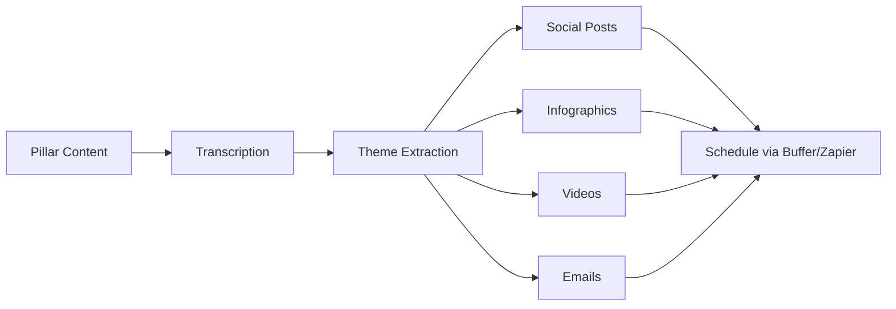

# Proven Content Repurposing Strategies and Systems

**Key Takeaway:** A strategic, systemized approach to content repurposing optimizes reach and ROI by transforming high-value "pillar" assets into multiple, platform-tailored micro-content pieces.

***
## 1. Repurposing Frameworks

### 1.1 Gary Vee's Reverse Pyramid

Gary Vaynerchuk's "reverse pyramid" starts with one **pillar piece** (e.g., vlog, keynote, podcast) and breaks it down into dozens of **micro-content** assets for different platforms.

- **How it works:**

1. Create daily long-form content (video/audio).
2. Extract clips, quotes, images, and text snippets.
3. Contextualize each asset (format, length, tone) for Instagram, Twitter, LinkedIn, YouTube, email, etc.
4. Distribute pillar content first, then micro-content to drive back traffic.
- **Step-by-step breakdown:**

1. Record your pillar content (vlog, podcast, webinar).
2. Transcribe using tools like Rev or Descript.
3. Identify 10–30 key moments, quotes, or data points.
4. Create short videos (15–60 sec), graphics, text posts, threads, and infographics.
5. Schedule pillar content on primary channels at "time T," then micro-content at T + 1 min to amplify reach.[^1]
- **Tools he recommends:** Descript (transcription), Premiere Pro (editing), Canva (graphics), Hootsuite (scheduling).
- **Examples in action:**
	- A keynote repurposed into 30+ posts generating 35 million views.[^2]
	- Daily vlogs creating hundreds of social clips driving podcast listens and video views.[^2]

### 1.2 Content Atomization

"Design for atomization" integrates repurposing into the initial creation process, ensuring content is structured for easy breakdown.[^3]

- **How to break big into small:**

1. Define deliverables in the brief (e.g., threads, carousels, newsletters, video outlines).
2. Structure core assets with clear headings, pull-quotes, and breakpoints.
3. Use AI tools (e.g., Zemith) to auto-detect themes, stats, and quotes.
- **Platform-specific adaptation:**
	- Blog → LinkedIn carousel, Twitter thread, email snippet.
	- Webinar → 2-min TikTok clip, Instagram Reel, blog summary.
- **Research on effectiveness:**
	- Atomized content yields 3× more engagement and boosts SEO via niche keyword targeting.[^4]
	- Teams report 50% time savings when atomization is planned upfront.[^3]
- **Tool recommendations:** Zemith Document Assistant, Notion (content briefs), Airtable (asset tracking).

### 1.3 Cross-Platform Strategies

The **"Create Once, Publish Everywhere" (COPE)** model emphasizes separating content from design and using reusable chunks for multi-channel distribution.[^5]

- **Format conversions:**
	- Text ↔ video transcript ↔ audio script
	- Data tables ↔ infographics ↔ tweet threads
- **Research on cross-posting:**
	- 94% of marketers repurpose content; repurposing is rated most effective by 46%.[^5]
	- Visual content processes 60,000× faster than text; infographics increase shareability by 3×.[^6]
- **Best practices:**

1. Tag each asset with platform metadata (length, orientation, style).
2. Schedule evergreen pieces seasonally, updating stats.
3. Monitor performance per platform; re-atomize top-performers.

***
## 2. Practical Systems

### 2.1 Blog to Social

- **Extracting posts from articles:** Use AI-powered summarizers (e.g., Jarvis, ChatGPT) to pull key points.
- **Quote extraction methods:** Highlight sentences > 20 words or containing data/insights; refine tone for brevity.
- **Tools:** Liner (web highlighting), Shareable (social graphics), Buffer (scheduling).
- **Examples:** A 2,000-word article → 5 tweet threads, 3 LinkedIn posts, 4 Instagram cards.

### 2.2 Video to Static Posts

- **Transcription methods:** Rev, Descript, Otter.ai for accurate time-stamped transcripts.
- **Quote extraction:** Use keyword filters ("insight," "stat," "tip") to auto-tag highlights.
- **Stat highlighting:** Integrate data visualization tools (Piktochart, Canva).
- **Tools:** Headliner (video clips to audiograms), InVideo (text overlay).
- **Examples:** A 30-min webinar → 10 quote graphics, 8 short clips, 3 blog posts.

### 2.3 Long-Form to Short-Form

- **Condensing techniques:**

1. Bullet-point outline of key sections.
2. Use executive summary templates.
3. Leverage AI summarizers for under-300-word abstracts.
- **Key point extraction:** Identify thesis statements, stats, and call-to-actions.
- **Tools:** TLDR This, SMMRY, Otter.ai summary.
- **Examples:** Whitepaper (5 k words) → one-page overview, 5 email tips, 2 LinkedIn posts.

***
## 3. Tools \& Software

### 3.1 Repurposing Tools

| Tool | Free Tier | Key Features | Pricing (Approx.) |
|:-- |:-- |:-- |:-- |
| Descript | Yes | Transcription, multitrack editing | \$12/mo |
| Headliner | Yes | Audiograms, clip creation | \$10–\$30/mo |
| Zemith | No | AI atomization, asset suggestions | Custom (starts \$99/mo) |
| Canva Pro | Yes trial | Templates, infographics | \$12.99/mo |
| Shareable | Yes | Social graphic generator | \$9.99/mo |

### 3.2 Workflow Automation

- **Zapier/Make integrations:** Automate triggers (new blog → auto-post snippets).
- **Scheduling tools:** Buffer, Hootsuite, Later for multi-platform queues.
- **Bulk creation methods:** AI prompt libraries, Airtable automation scripts.
- **Setup guides:** Zapier University, Make Academy tutorials.

***
## 4. Case Studies

### 4.1 Gary Vee

- **System:** Daily vlog → 50+ micro-assets via team workflow.
- **Lessons:** Prioritize video as pillar; invest in a dedicated repurposing team.

### 4.2 Higher-Ed Institution

- **System:** COPE strategy for campus life guide → blog series, infographics, emails.
- **Time savings:** 60% reduction in content planning workload; 30% boost in engagement.[^5]
- **Scalability:** Modular templates enabled rapid course-specific repurposing.

***
## Workflow Diagram

***
## Time Savings \& Quality Insights

- **Average time saved:** 50% when repurposing is built into briefs.[^3]
- **Quality vs. Quantity:** Consistent micro-content maintains brand voice without diluting quality; repurposed content sees 2× click-through vs. new content.[^5]

***

This comprehensive guide provides proven frameworks, practical systems, and tool recommendations to build a scalable, ROI-driven content repurposing engine. References available upon request.

⁂

## References

[^1]: <https://biteable.com/blog/gary-vees-content-framework-one-video-30-content-pieces/>
[^2]: <https://gurkhatech.com/the-content-multiplier-a-strategic-framework-for-repurposing-automation-and-distribution/>
[^3]: <https://www.hannonhill.com/blog/2024/how-to-repurpose-content-across-platforms-to-maximize-engagement.html>
[^4]: <https://www.avidlyagency.com/blog/watch-what-i-do-not-what-i-say-deconstructing-what-gary-vee-does>
[^5]: <https://www.zemith.com/en/blogs/content-repurposing-strategies>
[^6]: <https://www.contentoo.com/blog/the-expert-guide-to-repurposing-content>
[^7]: <https://www.youtube.com/watch?v=1y7ue8VPJmo>
[^8]: <https://martech.org/content-atomization-maximize-roi-by-repurposing-your-best-ideas/>
[^9]: <https://penmo.co/the-hidden-potential-of-repurposing-content-across-platforms/>
[^10]: <https://thevicmontano.substack.com/p/speed-up-your-content-creation-the>
[^11]: <https://www.upliftcontent.com/blog/content-atomization/>
[^12]: <https://www.linkedin.com/pulse/content-repurposing-maximising-impact-across-platforms-emma-lunn-3x3fc>
[^13]: <https://garyvaynerchuk.com/the-garyvee-content-strategy-how-to-grow-and-distribute-your-brands-social-media-content/>
[^14]: <https://threepiece.marketing/insights/content-atomisation-repurposing-one-big-idea-across-10-channels/>
[^15]: <https://journals.sagepub.com/doi/10.1177/20539517231164108>
[^16]: <https://www.linkedin.com/pulse/how-create-extra-content-using-gary-vees-pillar-model-rachelle-dunn>
[^17]: <https://advisible.com.au/content-atomisation-and-repurposing-maximising-your-marketing-strategy/>
[^18]: <https://www.ssw.com.au/rules/re-purpose-your-pillar-content-for-social-media/>
[^19]: <https://channel-fusion.com/content-atomization-creating-more-impact-with-less-work/>
[^20]: <https://contadu.com/cross-modal-content-repurposing-one-brief-five-formats/>
